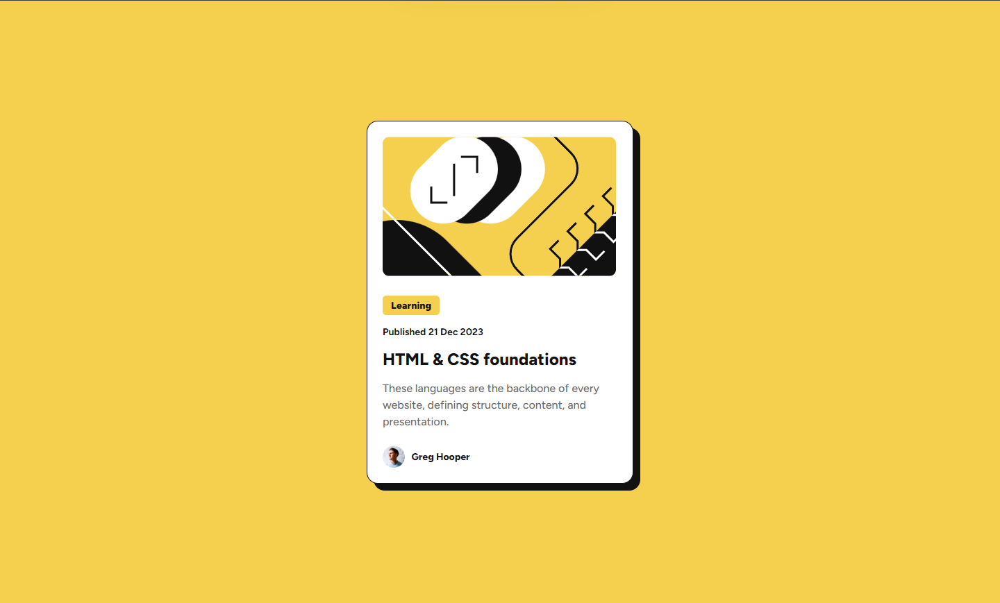
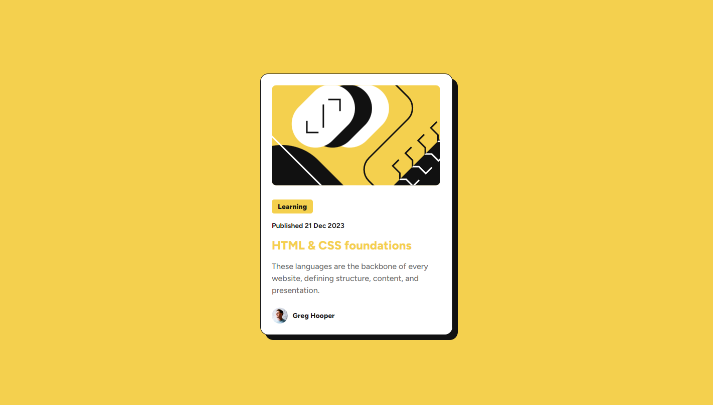

# Frontend Mentor - Blog preview card solution

This is a solution to the [Blog preview card challenge on Frontend Mentor](https://www.frontendmentor.io/challenges/blog-preview-card-ckPaj01IcS).

### Screenshot

### active Screenshot

### Links

- Solution URL: [Solution URL here](https://www.frontendmentor.io/solutions/blog-preview-card-T6whObeb2Z)
- Live Site URL: [Live site URL here](https://tuhin-jr.github.io/Frontend-Mentor---Blog-preview-card-solution/)

### Built with

- Semantic HTML5 markup
- CSS custom properties
- Flexbox

## Author

- Frontend Mentor - [@Tuhin-jr](https://www.frontendmentor.io/profile/Tuhin-jr)
